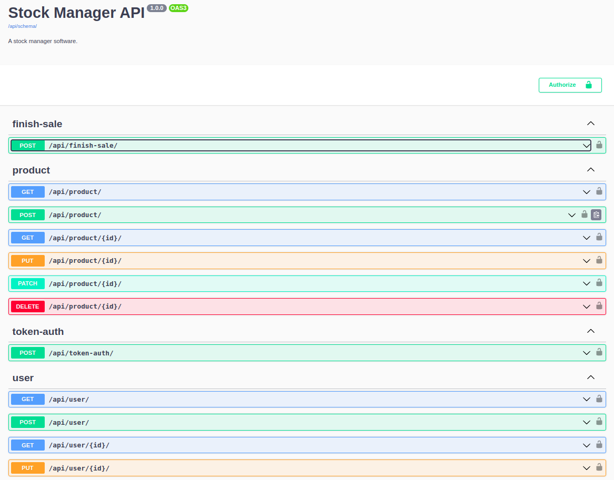

# ifrn-software-architecture-stock-manager

Sistema de gerenciamento de estoque - Disciplina - Arquitetura de Software.

Para executar o back, siga os passos abaixo:

Instalar dependências do projeto:

`pip install -r requeriments.txt`

Criar as tabelas no banco sqlite3:

`python manage.py migrate`

Criar superuser:

`python manage.py createsuperuser --email email.una@gmail.com --username my_name_admin`

Em seguinda execute o comando:

`python manage.py runserver`

Para executar o front, instale as dependencias:

`yarn install`
`npm install`

Para executar yarn ou npm:

`yarn dev`
`npm run dev`

## API DOCS

